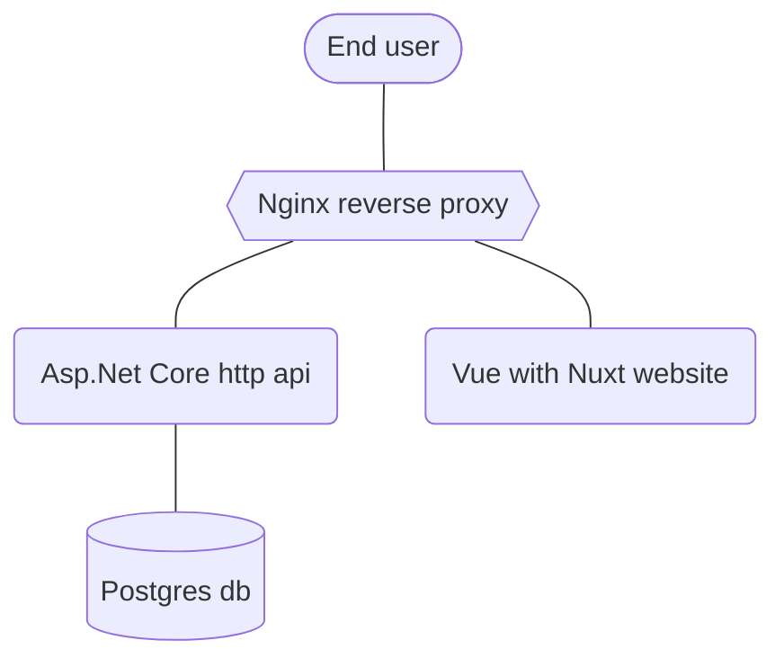
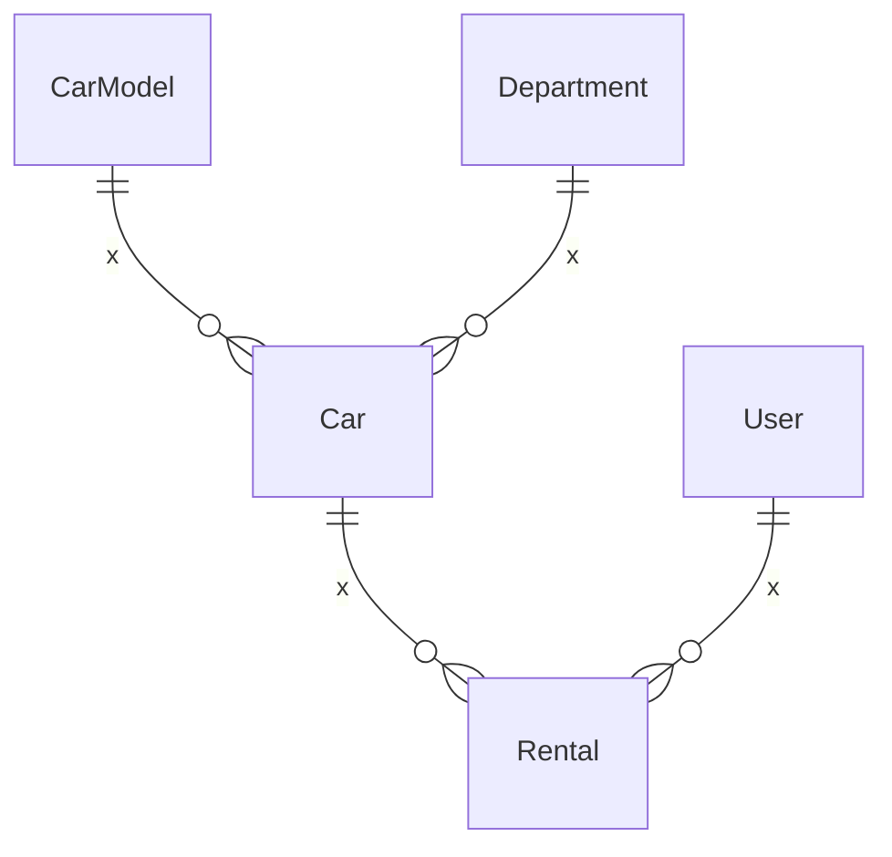

> **Note**
>
> Currently, application is still under development. Stay tuned for updates!

## 📝 Description

Sigma Cars is a car rental application. This is a learning
project that was created to practice and demonstrate the development of a full stack web application. Users can search
for cars by location, price, and availability, and make reservations for the selected car.

Technologies used are listed [here](#-technologies)

## 🚀 How to run

1. Install [Docker](https://www.docker.com/) and [Git](https://git-scm.com/downloads) on your machine.
2. Clone this repository by running `git clone https://github.com/kacperwyczawski/sigma-cars.git SigmaCars`.
3. Run with `docker compose up -f SigmaCars/docker-compose.yml`.

## ⭐ How to use

- After running the application, open `http://localhost` in your preferred web browser.
- There is default admin account with email: `admin@sigma.cars` and password: `admin`.

#### 💭 Optional

- You can access OpenAPI schema at `http://localhost/api/schema/v1` (can be imported into Postman).
- Base path for all REST API endpoints is `http://localhost/api`.

## ⚒️ How to develop

To apply changes to the codebase, append `--build` to the docker compose commands.

If you want to use hot reload for frontend:

2. `cd SigmaCars/Frontend`.
3. `npm run dev`.
1. `docker compose up -f ../docker-compose.dev.frontend.yml`.
4. Website is now available at `http://localhost:3000`.

    

        Details for Linux users
    

        There may be some problems with proxy_pass from nginx to host machine.
        This stackoverflow answer may help: https://stackoverflow.com/questions/24319662/from-inside-of-a-docker-container-how-do-i-connect-to-the-localhost-of-the-mach/43541681#43541681

## ℹ️ Other info

### 💻 Technologies

The following technologies were used in the development of this project:

- Backend: **Asp.Net Core**, **PostgreSQL**, EF Core, OpenAPI, FluentValidation, MediatR
- Frontend: **Nuxt**, **Vue**, TypeScript/JavaScript, TailwindCSS
- Other tools: **Docker**, **Nginx**, Postman, Rider

### 🐋 Docker

This project uses some docker configuration files:

1. ⭐ [docker-compose.yml](docker-compose.yml) for production
2. 🛠️ [docker-compose.dev.frontend.yml](docker-compose.dev.frontend.yml) for development (serving frontend locally)
3. ⭐ Backend [Dockerfile](Backend/Dockerfile)
4. ⭐ Database [Dockerfile](Database/Dockerfile)
5. ⭐ Frontend [Dockerfile](Frontend/Dockerfile)
6. ⭐ Reverse proxy [Dockerfile](ReverseProxy/Dockerfile)
7. 🛠️ Reverse proxy [DevFrontend/Dockerfile](ReverseProxy/DevFrontend/Dockerfile) for development (serving frontend
   locally)

### 🔗 Application schema

### 🗃️ Simplified database schema

## 📫 Feedback

I hope you find Sigma Cars project helpful! If you encounter any issues or have any feedback, please don't hesitate to
contact me via github issues.
