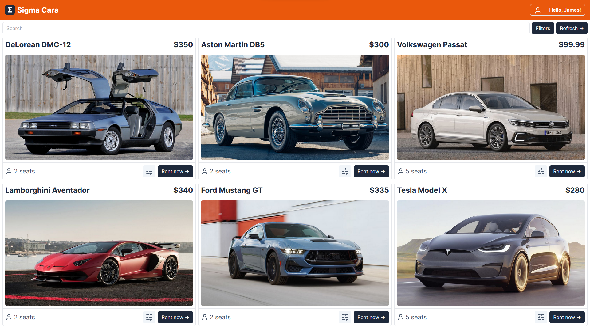
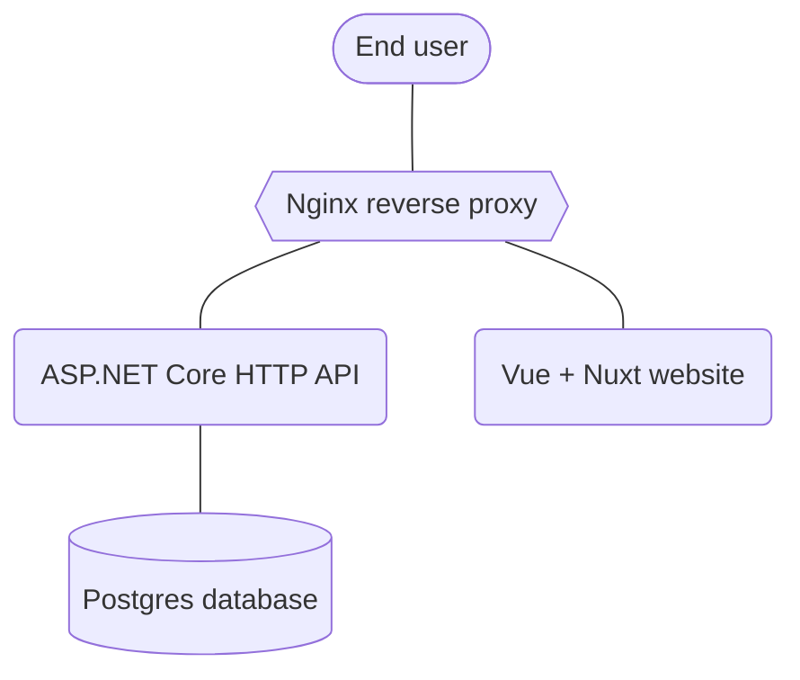
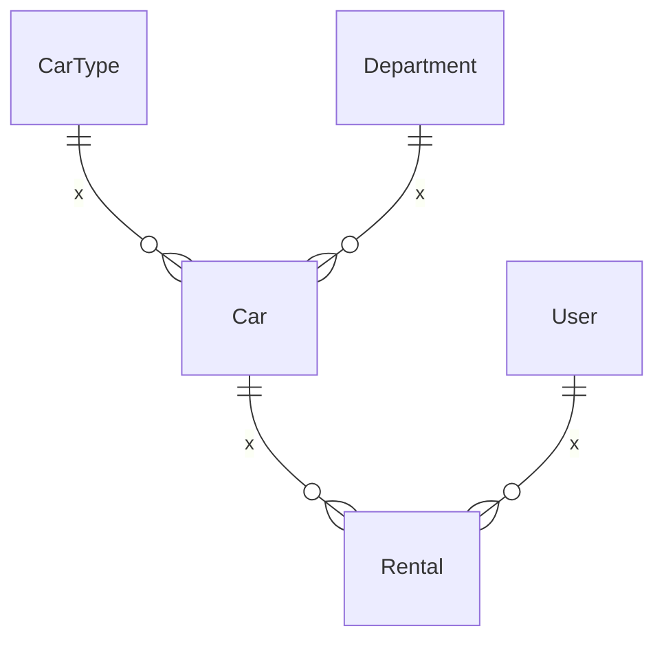

# Sigma Cars

> **Note**
>
> Application is under constant development. Stay tuned for updates!

## 📝 Description

Sigma Cars is a car rental application. This is a learning
project that was created to practice and demonstrate the development of a full stack web application. Users can search
for cars by location, price, and availability, and make reservations for the selected car.

- Sigma Cars is containerized using **Docker**, providing easy deployments and scalability.
- The backend is developed using **ASP.NET Core**, a high-performance framework, and utilizes a **PostgreSQL** database for efficient data storage and retrieval.
- The website is built using **Nuxt** and **Vue**, resulting in an interactive and visually appealing user interface. It is developed with a focus on type-safety by using **TypeScript**
- Project utilizes an **Nginx** proxy server, which acts as a reverse proxy, handling incoming requests and forwarding them to the appropriate services.
- This repository leverages **GitHub Actions** to automate the **CI/CD** process. This ensures that up-to-date images are pushed to **Docker Hub**, making it easy to deploy the latest version of the project.
- Users can choose to access the system via the **REST API** documented by **OpenAPI** schema, allowing programmatic interactions, or use the website for a user-friendly graphical interface.

## 🚀 How to run

1. Install and set up [Docker](https://www.docker.com/) on your machine.
2. Download [this](docker-compose.yml) file from repository. In PowerShell you can use: `Invoke-WebRequest https://raw.githubusercontent.com/kacperwyczawski/sigma-cars/main/docker-compose.yml -OutFile docker-compose.yml`.
3. Open Docker Desktop, ensuring that it is properly installed and running.
4. In your terminal or command prompt, navigate to the directory where you downloaded the docker-compose.yml file.
5. Run `docker compose up` to start the project.

## ⭐ How to use

- After running the application, open [`http://localhost`](http://localhost) in your preferred web browser.
- There is default admin account with email: `admin@sigma.cars` and password: `admin`.

#### 💭 Optional

- You can access OpenAPI schema at [`http://localhost/api/schema/v1`](http://localhost/api/schema/v1) (can be imported into Postman).
- Base path for all REST API endpoints is `http://localhost/api`.

## ⚒️ How to develop

First you need to clone this repository. After making changes, you can run the application with `docker compose up --build`.

If you want to use hot reload for frontend:

1. `cd SigmaCars/Frontend`.
2. `npm run dev`.
3. `docker compose up -f ../docker-compose.dev.frontend.yml`.
4. Website is now available at [`http://localhost`](http://localhost).

    

        Details for Linux users:
    

        There may be some problems with proxy_pass from nginx to host machine.
        This stackoverflow answer may help: https://stackoverflow.com/questions/24319662/from-inside-of-a-docker-container-how-do-i-connect-to-the-localhost-of-the-mach/43541681#43541681

## 🔗 Application schema

## 🗃️ Simplified database schema

## 📫 Feedback

I hope you find Sigma Cars project helpful! If you encounter any issues or have any feedback, please don't hesitate to
contact me via github issues.
