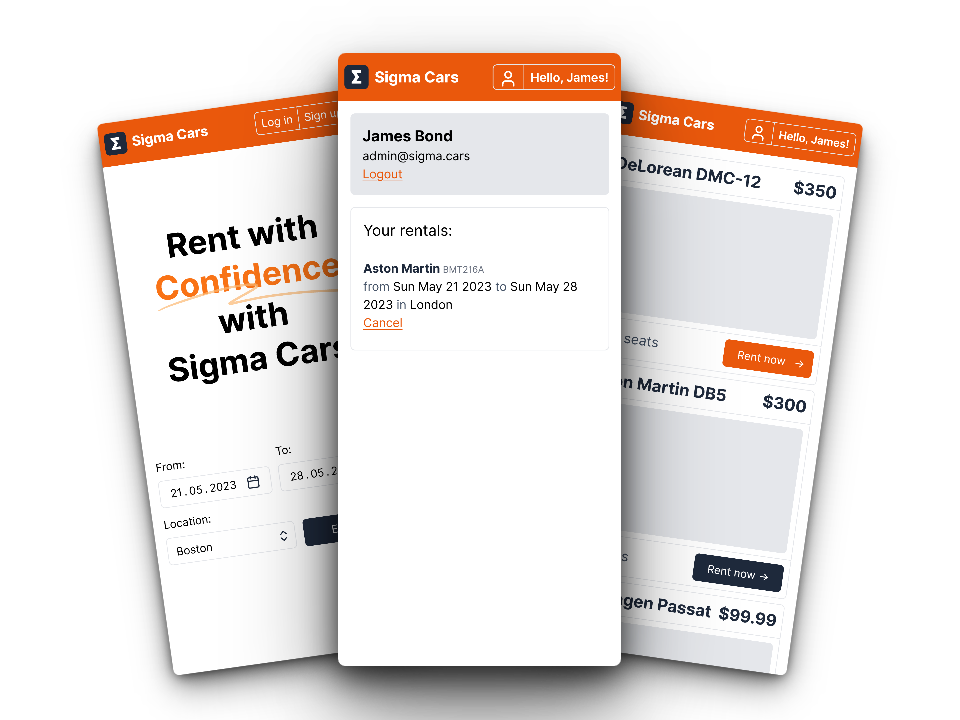

# Sigma Cars

> **Note**
>
> Application is under constant development. Stay tuned for updates!

## 📝 Description

Sigma Cars is a car rental application. This is a learning
project that was created to practice and demonstrate the development of a full stack web application. Users can search
for cars by location, price, and availability, and make reservations for the selected car.

Technologies used are listed [here](#-technologies)

## 🚀 How to run

1. Install and set up [Docker](https://www.docker.com/) on your machine.
2. Download [this](docker-compose.yml) file from repository. In PowerShell you can use: `Invoke-WebRequest https://raw.githubusercontent.com/kacperwyczawski/sigma-cars/main/docker-compose.yml -OutFile docker-compose.yml`.
3. Open Docker Desktop, ensuring that it is properly installed and running.
4. In your terminal or command prompt, navigate to the directory where you downloaded the docker-compose.yml file.
5. Run `docker compose up` to start the project.

## ⭐ How to use

- After running the application, open `http://localhost` in your preferred web browser.
- There is default admin account with email: `admin@sigma.cars` and password: `admin`.

#### 💭 Optional

- You can access OpenAPI schema at `http://localhost/api/schema/v1` (can be imported into Postman).
- Base path for all REST API endpoints is `http://localhost/api`.

## ⚒️ How to develop

First you need to clone this repository. After making changes, you can run the application with `docker compose up --build`.

If you want to use hot reload for frontend:

1. `cd SigmaCars/Frontend`.
2. `npm run dev`.
3. `docker compose up -f ../docker-compose.dev.frontend.yml`.
4. Website is now available at `http://localhost:3000`.

    

        Details for Linux users:
    

        There may be some problems with proxy_pass from nginx to host machine.
        This stackoverflow answer may help: https://stackoverflow.com/questions/24319662/from-inside-of-a-docker-container-how-do-i-connect-to-the-localhost-of-the-mach/43541681#43541681

## ℹ️ Other info

### 💻 Technologies

The following technologies were used in the development of this project:

- Backend: **Asp.Net Core**, **PostgreSQL**, EF Core, OpenAPI, FluentValidation, MediatR
- Frontend: **Nuxt**, **Vue**, TypeScript/JavaScript, TailwindCSS, HeadlessUI
- Other tools: **Docker**, **Nginx**, Postman, Rider

### 🔗 Application schema

### 🗃️ Simplified database schema

## 🤔 FAQ

**Q: Why postgres instead of for example mssql?**

A: Because postgres works better with Docker, I can put SQL script inside special directory and it's automatically run when container is ready.

**Q: Does somebody realy asks these questions?**

A: No.

## 📫 Feedback

I hope you find Sigma Cars project helpful! If you encounter any issues or have any feedback, please don't hesitate to
contact me via github issues.
